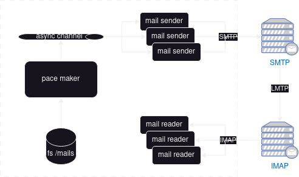

# mailtempest [](https://dl.circleci.com/status-badge/redirect/gh/iroco-co/mailtempest/tree/main)

> If we can’t face it, we can’t escape it  
> But tonight the storm’s come  
> -- Kate Tempest - Tunnel Vision

This is a mail injector based on tokio and [Stalwart Labs](https://github.com/stalwartlabs) mail libraries.

For IMAP it's using [async_imap](https://github.com/async-email/async-imap).

It is intended to bench your mail servers and your mail server settings.

# How does it work?



```shell
mailtempest 0.1.0
Mail injector to generate SMTP/IMAP load to a mail platform

USAGE:
    mailtempest [OPTIONS] <smtp-host> [imap-host]

FLAGS:
    -h, --help       Prints help information
    -V, --version    Prints version information

OPTIONS:
        --mail-dir <mail-dir>            directory where the mails are going to be read. Default to './mails'
        --pace-seconds <pace-seconds>    average pace of injection in second for pace maker (float). Default to 1s
        --prepare <prepare>              utility prepare command (boolean). It will use the CSV file to replace all the
                                         email addresses in the files located in mail directory and rewrite them with
                                         .mt extension
        --users-csv <users-csv>          CSV file where users login/password can be loaded. Defaults to users.csv
        --workers <workers>              number of workers

ARGS:
    <smtp-host>    host of the SMTP server
    <imap-host>    host of the IMAP server
```

If you want [logs](https://docs.rs/env_logger/latest/env_logger/) you can use the env variable `RUST_LOG`:

```shell
RUST_LOG=info mailtempest smtp.host imap.host
```

## For SMTP inbound mail

It reads mail samples from a directory and randomly send them to the configured SMTP url. 

It is multithreaded and will send mails concurrently with `workers` threads (=number of mail users for now).

It sends them with an average of `worker_pace` seconds. It can be set to 0 to continuously send mails.

## For IMAP reading

IMAP clients are run if the imap host is provided.

Clients are logging in at launch. Then the INBOX is selected.

The loop is using [IMAP IDLE](https://en.wikipedia.org/wiki/IMAP_IDLE). Each time an email is received it is fetched. 
